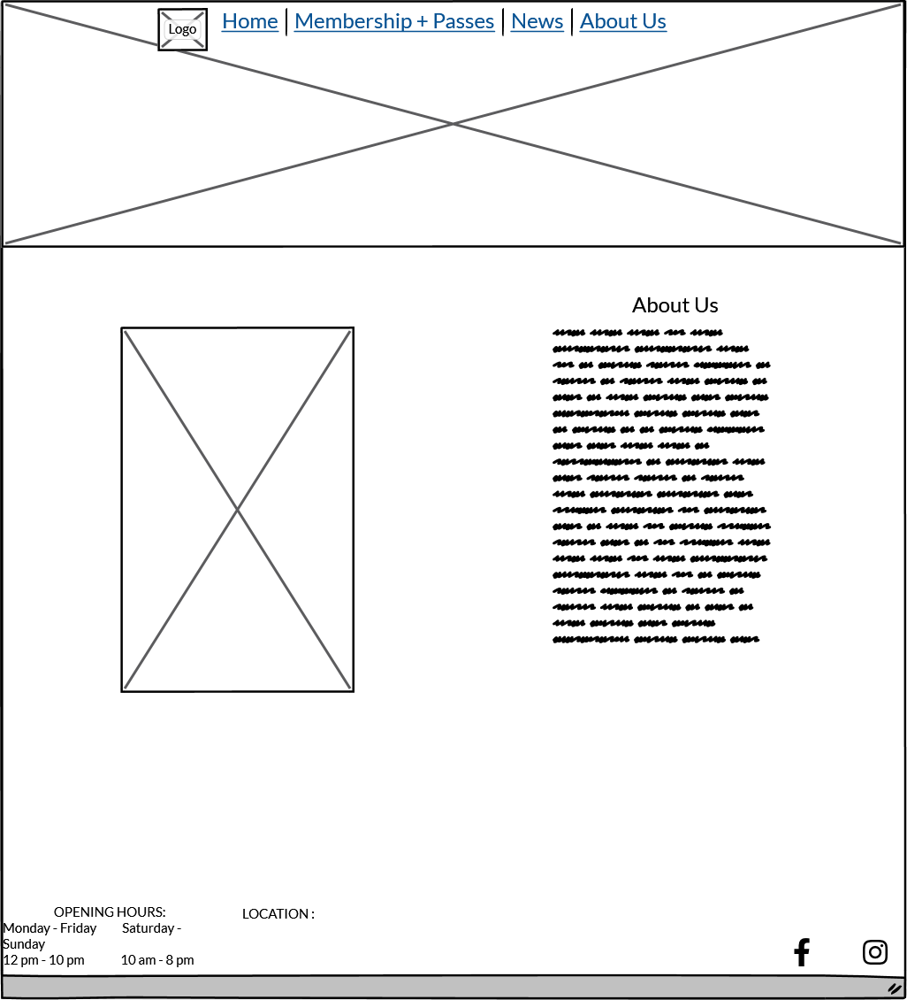

# Chalk Climbing Centre

Chalk is a website for a premier indoor climbing gym where users can find out more information about the pricing, location and related news. 

View the live site: [Chalk Climbing Centre](https://bidran.github.io/Chalk-Climbing-Centre/)

## Contents

## User Experience (UX)

### Initial Discussion
Chalk climbing centre is an indoor rock climbing gym, a place that helps you overcome your obstacles and become a better you.

#### Key information for the site

* What is Chalk Climbing Centre.
* What's the location.
* How to become a member.
* Updates on events being organized.

### User Stories

#### Client Goals

* To be able to view the site on a range of device sizes.
* To make it easy for potential members to find out what Chalk Climbing Centre is and how to join.
* To allow people to be able to know the relevant information regarding pricing without having to come to the gym in person.

#### First Time Visitor Goals

* I want to find out what is Chalk Climbing Centre and how I can join.
* I want to be able to navigate the site easily to find information.
* I want to be able to find the location of the gym.

#### Returning Visitor Goals

* I want to refresh my memory on pricing model.
* I want to find out what the working hours are.
* I want to be able to easily contact the book club with questions I might have.

#### Frequent Visitor Goals

* I want to be able to find out if there are any events coming up that might be of interest to me.

## Design

### Typography

Font family Courier New was used with Courier and monospace functioning as backups.

### Imagery

Images used were from stock images websites Shutterstock and Pexels. They have been credited in the [credits](#Credits) section.

### Wireframes

Wireframes created for desktop and mobile showing the original idea behind the project.

#### Home

#### Membership

#### News

#### About Us

### Features

The website is comprised of five pages, four of which are accessible from the navigation menu (home page, membership, news & about us page). The fourth page is an induction page which is accessible through a link on the home page.

* All Pages on the website have:

  * A responsive navigation bar at the top which allows the user to navigate through the site.  To the left of the navigation bar is an image of Chalk Climbing Centre's logo which also leads to the home page. To the right of the navigation bar are the links to the websites pages (home page, membership, news & about us). To allow a good user experience of the site, the Chalk Climbing Centre's logo is hidden with a media query on mobile devices to prevent the navigation bar looking cluttered and undersized.

  * A footer which contains information on opening hours and the location along with social media icon links to facebook and instagram.

  * A hero image with the title of Chalk Climbing Centre

* Home Page.
  * Intro Section.

    An introduction on what Chalk Climbing Centre is all about.
  * A graph.

     A graph which shows the busiest hours that allows members to come to the gym when it's less busy if that is their choice.
  * Links section.
    
    This section allows the user to navigate and snap viewport to different parts of the website by clicking on the images. (Pricing, Induction and About Us page)

* Membership.
  * Day pass section.

    Information about registration, shoe hire and a table with pricing for single entry. 

  * Membership section.
    
    This section allows the user to find out information about variation in pricing between 3, 6 and 12 month memberships.

* News.
  * News section.

    Each news article contains an image, date published and an information about past or upcoming events seperated by a line.

* About Us.
  * About us section.

    This section provides information about owners of the gym along with an image of them inside the gym. 

* Induction.
  * Induction section.

    This section provides gives information on our procedure for climbers coming for the first time to the gym along with an image of one of the instructors. 
  

### Accessibility
The website has been made with accessibility in mind for ease of access which was achieved by:

* Using semantic HTML.
* Using descriptive alt attributes on images on the site.
* Ensuring that there is a sufficient colour contrast throughout the site.
* Ensuring menus are accessible by marking the current page as current for screen readers.

## Technologies Used

Visual Studio Code - To code the website.

Balsamiq - Used to create wireframes.

Git - For version control.

Github - To save and store the files for the website.

Font Awesome - For the iconography on the website.

Google Dev Tools - To troubleshoot and test features, solve issues with responsiveness and styling.

[11zon](https://www.11zon.com/) To compress images.

[Shutterstock](https://www.shutterstock.com/) To acquire royalty free images.

[Pexels](https://www.pexels.com/) To acquire royalty free images.

[Favicon.io](https://favicon.io/) To create favicon.

[Am I Responsive?](http://ami.responsivedesign.is/) To show the website image on a range of devices.

[Pixlr](https://pixlr.com/) To edit the images to fit the theme of the website.

### Languages Used

The structure of the website was developed using HTML as the main language.

The website was styled using CSS.

## Deployment & Local Development

### Deployment

The site was created using the Visual Studio code editor and pushed to github to the remote repository ‘Chalk-Climbing-Centre’.

Github Pages was used to deploy the live website. The instructions to achieve this are below:

1. Log in (or sign up) to Github.
2. Find the repository for this project, Chalk-Climbing-Centre.
3. Click on the Settings link.
4. Click on the Pages link in the left hand side navigation bar.
5. In the Source section, choose main from the drop down select branch menu. Select Root from the drop down select folder menu.
6. Click Save. Your live Github Pages site is now deployed at the URL shown.

### Local Development

#### How to Fork

To fork the Chalk-Climbing-Centre repository:

1. Log in (or sign up) to Github.
2. Go to the repository for this project, bidran/Chalk-Climbing-Centre.
3. Click the Fork button in the top right corner.

#### How to Clone

To clone the Chalk-Climbing-Centre repository:

1. Log in (or sign up) to GitHub.
2. Go to the repository for this project, bidran/Chalk-Climbing-Centre.
3. Click on the code button, select whether you would like to clone with HTTPS, SSH or GitHub CLI and copy the link shown.
4. Open the terminal in your code editor and change the current working directory to the location you want to use for the cloned directory.
5. Type 'git clone' into the terminal and then paste the link you copied in step 3. Press enter.

## Testing

### W3C Validator
* HTML
  * No errors were returned when passing through the official [W3C validator](https://validator.w3.org)

  * CSS
   * No errors were found when passing through the official [(Jigsaw) validator](https://jigsaw.w3.org)

        

### Solved Bugs
    On 320px devices it was scrollable to the right
    Fixed by changing font size on h1 caused by shadow and sizing down images

    Graph fixed positioning

    Fix text positioning on images
### Known Bugs
### Testing User Stories
### Lighthouse
### Full Testing

## Credits

### Code Used
### Content
### Media
### Acknowledgments