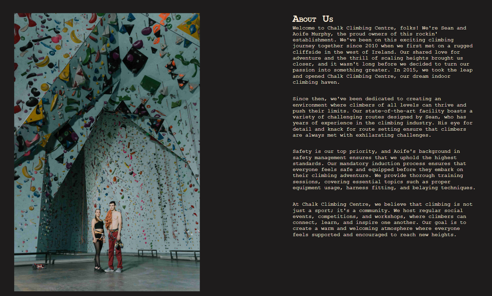

# Chalk Climbing Centre

Chalk is a website for a premier indoor climbing gym where users can find out more information about the pricing, location and related news. 

View the live site: [Chalk Climbing Centre](https://bidran.github.io/Chalk-Climbing-Centre/)

## CONTENTS

* [User Experience](#user-experience-ux)
  * [User Stories](#user-stories)

* [Design](#design)
  * [Imagery](#imagery)
  * [Wireframes](#wireframes)

* [Features](#features)
  * [General Features on Each Page](#general-features-on-each-page)
  * [Accessibility](#accessibility)

* [Technologies Used](#technologies-used)
  * [Languages Used](#languages-used)

* [Deployment & Local Development](#deployment--local-development)
  * [Deployment](#deployment)
  * [Local Development](#local-development)
    * [How to Fork](#how-to-fork)
    * [How to Clone](#how-to-clone)

* [Testing](#testing) 
  *[W3C Validator](#w3c-validator)
  *[Lighthouse](#lighthouse)

* [Credits](#credits)
  * [Content](#content)
  * [Media](#media)
  * [Acknowledgments](#acknowledgments)

## User Experience (UX)

### Initial Discussion
Chalk climbing centre is an indoor rock climbing gym, a place that helps you overcome your obstacles and become a better you.

#### Key information for the site

* What is Chalk Climbing Centre.
* What's the location.
* How to become a member.
* Updates on events being organized.

### User Stories

#### Client Goals

* To be able to view the site on a range of device sizes.
* To make it easy for potential members to find out what Chalk Climbing Centre is and how to join.
* To allow people to be able to know the relevant information regarding pricing without having to come to the gym in person.

#### First Time Visitor Goals

* I want to find out what is Chalk Climbing Centre and how I can join.
* I want to be able to navigate the site easily to find information.
* I want to be able to find the location of the gym.

#### Returning Visitor Goals

* I want to refresh my memory on pricing model.
* I want to find out what the working hours are.
* I want to be able to easily contact the book club with questions I might have.

#### Frequent Visitor Goals

* I want to be able to find out if there are any events coming up that might be of interest to me.

## Design

### Typography

Font family Courier New was used with Courier and monospace functioning as backups.

### Imagery

Images used were from stock images websites Shutterstock and Pexels. They have been credited in the [credits](#Credits) section.

### Wireframes

Wireframes created for desktop and mobile showing the original idea behind the project.

#### Home

#### Membership

#### News

#### About Us

### Features

The website is comprised of five pages, four of which are accessible from the navigation menu (home page, membership, news & about us page). The fourth page is an induction page which is accessible through a link on the home page.

### General features on each page

#### All Pages on the website have:

  * Navigation Bar
    * Contains links to home, membership, news & about us pages with a logo that also leads to the home page.
    * This allows the user to navigate between importan pages to have information that they require.

        
  * A hero image
    * Contains an hero image with a title of Chalk Climbing Centre
    * Makes user immediately aware of what the website is about and the name of the gym.

        

#### Home Page.
  * Intro Section.

    * An introduction on what Chalk Climbing Centre is all about with a graph.
    * Gives basic info about the gym along with the busiest hours that allows members to come to the gym when it's less busy.

        

 * Links section.
    
    * Containts 3 images leading to Pricing, Induction and About Us.
    * This section allows the user to navigate and snap viewport to different parts of the website by clicking on the images. The images expand when hovered over (Pricing, Induction and About Us page)

        

#### Membership page.

 * Membership section.
    * Information about registration, shoe hire and a table with pricing for single entry and monthly memberships. 
    * Allows the user to know the exact information about how much it will cost them.

        
      

 #### News page.
  * News section.
    * Each news article contains an image, date published and a paragraph seperated by a line. 
    * Allows user to find out information about past or upcoming events. 

        

 #### About Us page.
  * About us section.

    * Contains an image with a paragraph about the gym.
    * This section provides information about owners of the gym along with an image of them inside the gym. 

        
 #### Induction page.
  * Induction section.

    * Contains an image with a paragraph about induction.
    * This section provides information on our procedure for climbers coming for the first time to the gym along with an image of one of the instructors. 
      

### Accessibility
[Wave Accessibility](https://wave.webaim.org/) tool was used throughout development and for final testing of the deployed website to check for any aid accessibility testing.

Testing was focused to ensure the following criteria were met:

- Color contrasts meet a minimum ratio as specified in [WCAG 2.1 Contrast Guidelines](https://www.w3.org/WAI/WCAG21/Understanding/contrast-minimum.html)
- Heading levels are not missed or skipped to ensure the importance of content is relayed correctly to the end user
- All content is contained within landmarks to ensure ease of use for assistive technology, allowing the user to navigate by page regions
- All not textual content had alternative text or titles so descriptions are read out to screen readers
- HTML page lang attribute has been set
- Aria properties have been implemented correctly
- WCAG 2.1 Coding best practices being followed

Manual tests were also performed to ensure the website was accessible as possible and an accessibility issue was identified.

Issue #1: Wave showed error for missing table header

Fix: Added a table header for better accessibility

Issue #2: Footer contained an h3, while h2 was not present on all pages

Fix: Added h2 elements to all pages with information required for screen readers

## Technologies Used

* Visual Studio Code - To code the website.

* Balsamiq - Used to create wireframes.

* Git - For version control.

* Github - To save and store the files for the website.

* Font Awesome - For the iconography on the website.

* Google Dev Tools - To troubleshoot and test features, solve issues with responsiveness and styling.

* [11zon](https://www.11zon.com/) To compress images.

* [Shutterstock](https://www.shutterstock.com/) To acquire royalty free images.

* [Pexels](https://www.pexels.com/) To acquire royalty free images.

* [Favicon.io](https://favicon.io/) To create favicon.

* [Am I Responsive?](http://ami.responsivedesign.is/) To show the website image on a range of devices.

* [Pixlr](https://pixlr.com/) To edit the images to fit the theme of the website.

### Languages Used

* The structure of the website was developed using HTML as the main language.

* The website was styled using CSS.

## Deployment & Local Development

### Deployment

The site was created using the Visual Studio code editor and pushed to github to the remote repository ‘Chalk-Climbing-Centre’.

Github Pages was used to deploy the live website. The instructions to achieve this are below:

1. Log in (or sign up) to Github.
2. Find the repository for this project, Chalk-Climbing-Centre.
3. Click on the Settings link.
4. Click on the Pages link in the left hand side navigation bar.
5. In the Source section, choose main from the drop down select branch menu. Select Root from the drop down select folder menu.
6. Click Save. Your live Github Pages site is now deployed at the URL shown.

### Local Development

#### How to Fork

To fork the Chalk-Climbing-Centre repository:

1. Log in (or sign up) to Github.
2. Go to the repository for this project, bidran/Chalk-Climbing-Centre.
3. Click the Fork button in the top right corner.

#### How to Clone

To clone the Chalk-Climbing-Centre repository:

1. Log in (or sign up) to GitHub.
2. Go to the repository for this project, bidran/Chalk-Climbing-Centre.
3. Click on the code button, select whether you would like to clone with HTTPS, SSH or GitHub CLI and copy the link shown.
4. Open the terminal in your code editor and change the current working directory to the location you want to use for the cloned directory.
5. Type 'git clone' into the terminal and then paste the link you copied in step 3. Press enter.

## Testing

### W3C Validator
* HTML
  * No errors were returned when passing through the official [W3C validator](https://validator.w3.org)

* CSS
    * No errors were found when passing through the official [(Jigsaw) validator](https://jigsaw.w3.org)

### Lighthouse

Desktop lighthouse testing

 

 

 

 

Mobile lighthouse testing

 

  

 

 

 

### Solved Bugs
    On 320px devices it was scrollable to the right
    Fixed by changing font size on h1 caused by shadow and sizing down images

    Graph fixed positioning

    Fix text positioning on images

### Known Bugs

No bugs were found by me when final testing.
### Testing User Stories
### Full Testing

## Credits

### Content

Parts of the website were inspired by [Brooklyn Boulders](https://brooklynboulders.com)

### Media
A variety of stock images from [Pexels](https://www.pexels.com/) & [Shutterstock](https://www.shutterstock.com/) were used for this project.

* Site wide
    * [Hero image by Nejron Photo](https://www.shutterstock.com/image-photo/muscular-man-practicing-rockclimbing-on-rock-231079921)

* Home page
    * [Pricing link by Karolina Grabowska](https://www.pexels.com/photo/hands-holding-us-dollar-bills-4968384/)

    * [Induction link by Allan Mas](https://www.pexels.com/photo/anonymous-barefoot-climber-and-ethic-partner-ascending-artificial-rock-5384406/)

    * [About us link by cottonbrostudio](https://www.pexels.com/photo/woman-doing-wall-climbing-6700633/)
   

* News page
    * [Competition by cottonbro studio](https://www.pexels.com/photo/a-woman-climbing-a-bouldering-wall-6701735/)

    * [Outdoor by Photobac](https://www.shutterstock.com/image-photo/rock-climber-sunset-kalymnos-island-greece-116403520)

    * [Pizza by Sydney Troxell](https://www.pexels.com/photo/sliced-pepperoni-pizza-on-white-ceramic-plate-708587/)

* About us page
    * [About us](https://www.pexels.com/photo/light-city-fashion-man-6675098/)

* Induction page
    * [Induction by Allan Mas](https://www.pexels.com/photo/asian-male-trainer-speaking-with-unrecognizable-climber-before-training-5383538/)

* 404 page
    * [404 image by Prazis Images](https://www.shutterstock.com/image-vector/silhouette-two-male-climbers-rescuing-another-2264547757)        

### Acknowledgments

I would like to thank following people for helping me with my first project:
    
* [Gareth McGirr](https://github.com/Gareth-McGirr/) - My mentor, for helping me troughout this project with his advice
* Allen Gleeson, Marcin Mrugacz &  [Kera Cudmore](https://github.com/kera-cudmore) - For comments on improvement after posting in Slack Peer code review channel
